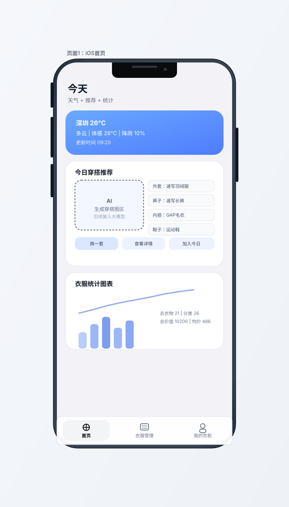
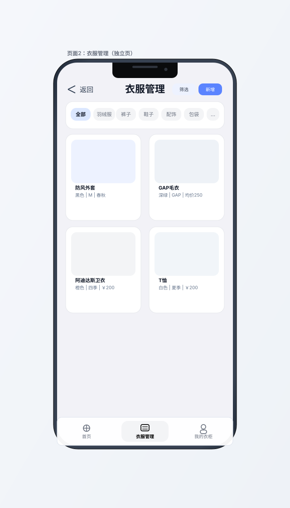
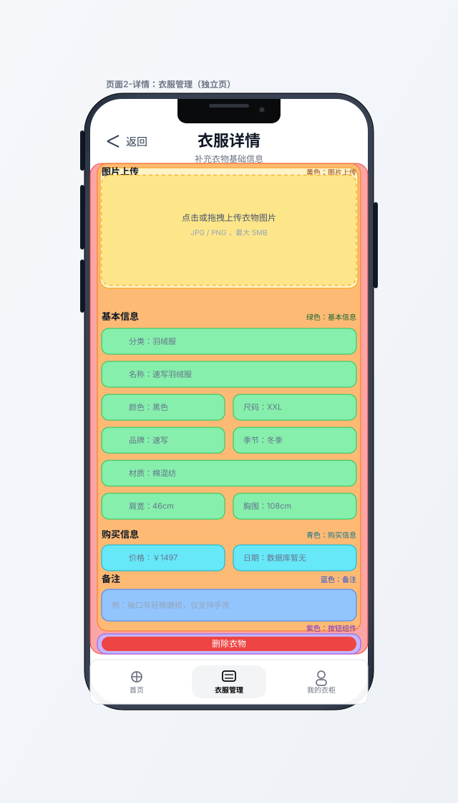
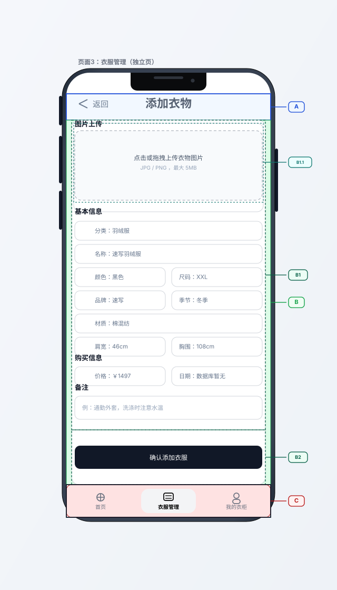
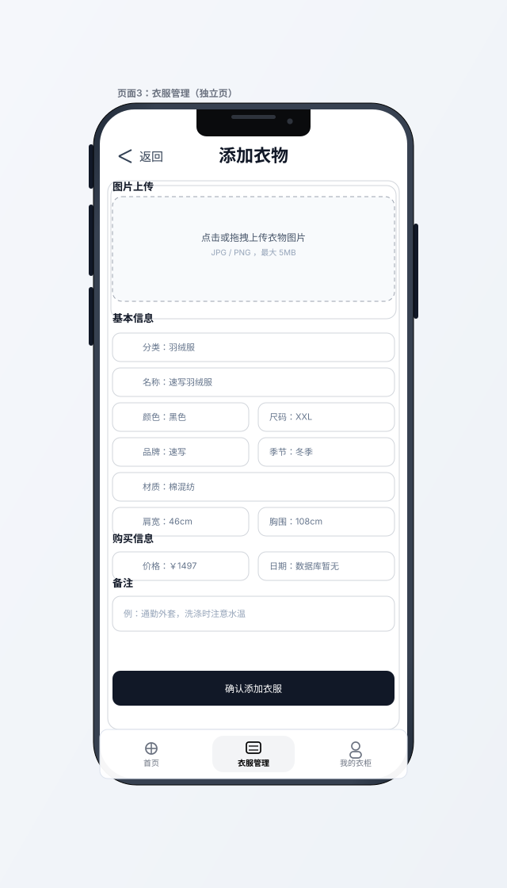
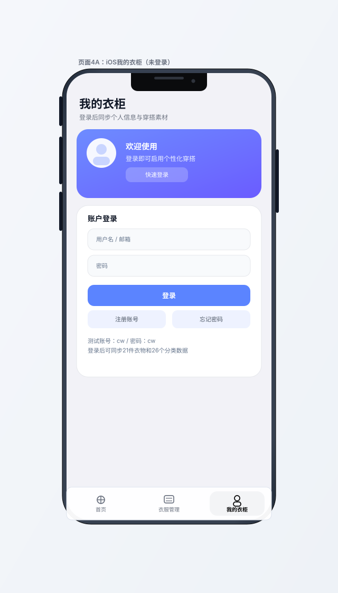
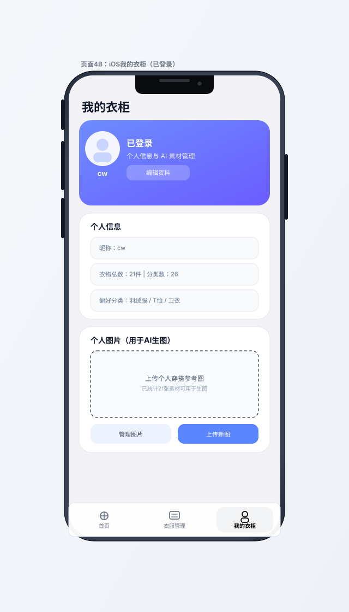

# SmartWardrobe 前端 UI 设计文档

## 手机竖屏适配缩略图

> 目标：单手操作、底部主导航、抽屉菜单、卡片流布局与安全区适配（刘海/手势条）。
>
> 范围：本轮仅重构前端页面设计与文档，不修改后端程序与接口。
>
> 数据说明：当前缩略图示例文案已按数据库 `wardrobe.db` 中 `cw` 账号的真实样本进行填充（衣物/分类/热门分类与示例单品）。

## iOS 规范映射清单（本项目）

- 字体：优先使用 `SF Pro Display / SF Pro Text`；标题用 Display，正文与表单用 Text
- 字号：页面主标题 `22`；分组标题 `13`；正文/表单值 `11-12`；辅助说明 `10`
- 间距：统一采用 `8pt` 栅格（`8/16/24/32`），组件上下间距优先取 8 的倍数
- 圆角：输入框 `10`；卡片容器 `12`；主按钮 `12`；结构分组框可用直角便于标注
- 导航高度：底部主导航按 `64` 视觉高度处理（含安全区表达）
- 安全区：顶部保留状态栏/刘海区视觉留白；底部保留 Home Indicator 安全区
- 按钮高度：主要操作按钮最小高度 `44`（页面3 的确认按钮按 44 执行）
- 页面3 结构：`A 顶部组件`、`B 内容组件`、`C 底部导航组件`；其中 `B = B1 + B2`，`B1.1` 为上传子组件

页面 1：首页（预留主页容器）  
Mobile Home Thumbnail

| 有标注版本 | 无标注版本 |
|---|---|
|  |  |

层次描述：壳层（手机外框+安全区） -> 页面主内容层（天气/推荐/统计/AI 占位） -> 底部主导航层（首页激活）

页面 2：衣服管理（展示衣服）  
Mobile Wardrobe Thumbnail

| 有标注版本 | 无标注版本 |
|---|---|
|  |  |

层次描述：壳层 -> 列表页内容层（标题/筛选标签/衣物卡片网格） -> 底部主导航层（衣服管理激活）

页面 2-详情：衣服详情（编辑/删除入口）  
Mobile Wardrobe Detail Thumbnail

| 有标注版本 | 无标注版本 |
|---|---|
|  |  |

层次描述：壳层 -> 红色外层组件 -> 橙色内层组件 -> 黄色上传小组件（标题+上传框） -> 绿色基本信息 -> 青色购买信息 -> 蓝色备注 -> 紫色底部按钮组件（位于橙色层下方） -> 底部主导航

页面 3：衣服管理（添加衣服）  
Mobile Wardrobe Add Thumbnail（添加衣服页）

| 有标注版本 | 无标注版本 |
|---|---|
|  |  |

层次描述：壳层 -> A 顶部组件（返回+添加衣物） -> B 内容组件（B1 信息表单组件 + B2 确认按钮组件；其中 B1.1=图片上传标题+上传框） -> C 底部导航组件

页面 4：我的衣柜（登录和账户信息）  
Mobile Mine Login Thumbnail（未登录）

| 有标注版本 | 无标注版本 |
|---|---|
|  |  |

层次描述：壳层 -> 未登录内容层（品牌、欢迎文案、登录表单、注册入口） -> 底部主导航层（我的衣柜激活）

Mobile Mine Profile Thumbnail（已登录）

| 有标注版本 | 无标注版本 |
|---|---|
|  |  |

层次描述：壳层 -> 已登录内容层（头像、昵称、资料、个人图片入口） -> 底部主导航层（我的衣柜激活）

## 前端改版方案（仅前端）

### 一、信息架构（iPhone 13 竖屏优先）

- 底部主导航：`首页` / `衣服管理` / `我的衣柜`
- 默认首屏：打开 App 先进入 `首页`
- 账号入口：`我的` 页承担登录/注册/退出与个人信息
- 全局原则：单手操作优先、重要信息首屏可见、少层级跳转
- 实施边界：仅调整前端 UI、交互与文档；后端 API/数据库逻辑保持不变

### 二、逐页页面设计要求（本轮）

- 页面 1 `首页`：顶部为页面标题与副标题，中部三块占位模块（天气、推荐、统计），底部固定三导航；强调“可扩展占位”而非业务完成度
- 页面 2 `衣服管理-展示`：顶部为返回+标题+操作入口（筛选/新增），中部为横向分类筛选条与双列卡片流，底部固定导航；卡片点击进入详情编辑页
- 页面 2-详情 `衣服详情`：沿用页面3表单结构，顶部返回与标题，中部为衣物信息表单，底部为操作按钮区；定位为独立页面而非弹窗
- 页面 3 `衣服管理-添加`：采用 A/B/C 三层结构（顶部区/内容区/导航区）；B 区再拆 B1（信息表单）+ B2（确认按钮），B1.1 为“图片上传标题+上传框”
- 页面 4 `我的衣柜`：同一页面支持未登录/已登录两态；未登录态显示登录入口，已登录态显示头像、资料与个人图片管理入口

### 三、页面清单（本轮 4 页）

- 页面 1：`首页`（占位模块 + 导航）
- 页面 2：`衣服管理-展示`（分类筛选 + 卡片流）
- 页面 3：`衣服管理-添加`（表单 + 图片上传 + 提交）
- 页面 4：`我的衣柜`（登录入口 + 个人中心双态）

### 五、关键用户流程

1. 打开 App -> 进入首页占位页  
2. 点击底部 `衣服管理` -> 展示与添加衣服  
3. 点击底部 `我的` -> 完成登录并维护个人信息/图片

### 六、第一阶段落地范围（建议）

- P0（本周）：页面 1（占位）+ 页面 2 + 页面 4 未登录态（前端）
- P1（下周）：页面 3 + 页面 4 已登录态（前端）
- P2（后续）：首页天气/推荐/统计与 AI 生图链路联调
