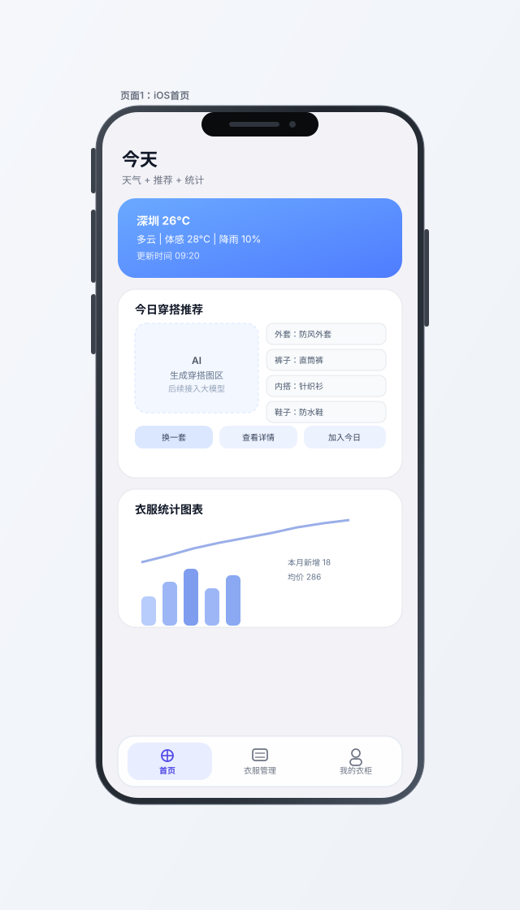
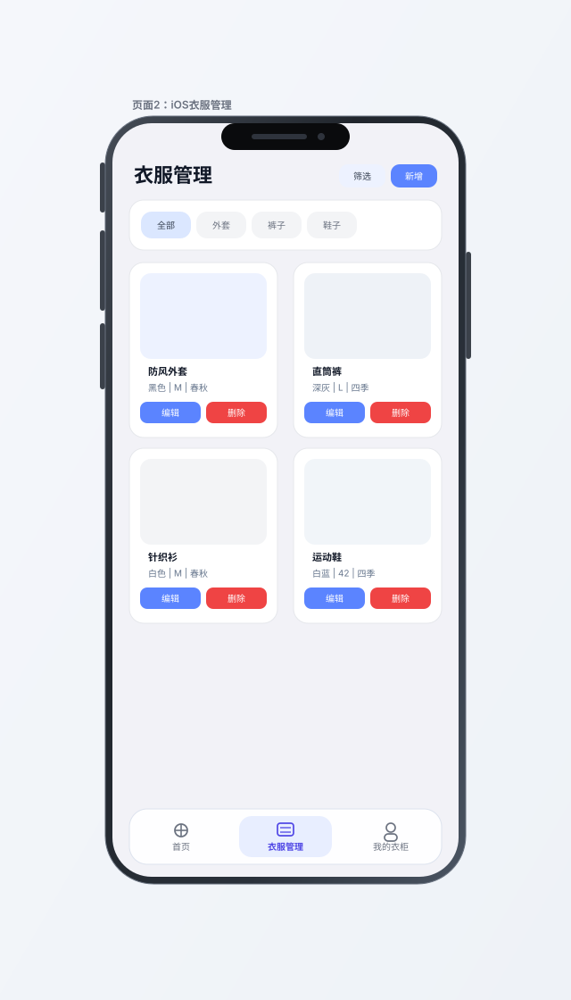
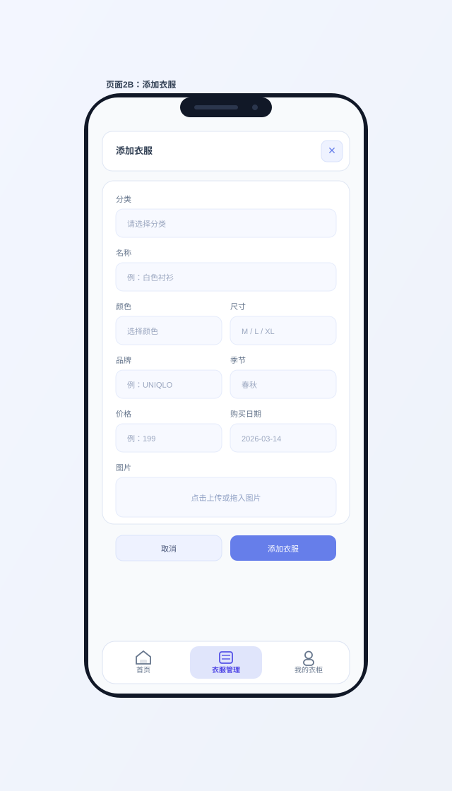
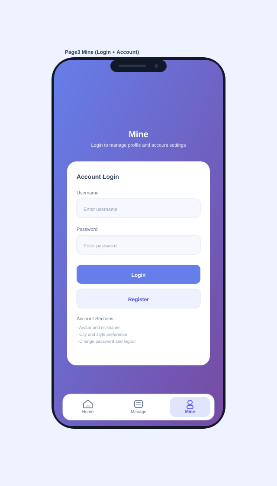
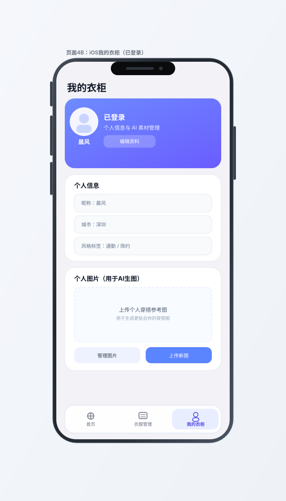

# SmartWardrobe 前端 UI 设计文档

## 手机竖屏适配缩略图

> 目标：单手操作、底部主导航、抽屉菜单、卡片流布局与安全区适配（刘海/手势条）。
>
> 范围：本轮仅重构前端页面设计与文档，不修改后端程序与接口。

页面 1：首页（预留主页容器）  
Mobile Home Thumbnail

页面 2：衣服管理（展示衣服）  
Mobile Wardrobe Thumbnail

页面 3：衣服管理（添加衣服）  
Mobile Wardrobe Add Thumbnail（添加衣服页）

页面 4：我的衣柜（登录和账户信息）  
Mobile Mine Login Thumbnail（未登录）

Mobile Mine Profile Thumbnail（已登录）

## 前端改版方案（仅前端）

### 一、信息架构（iPhone 13 竖屏优先）

- 底部主导航：`首页` / `衣服管理` / `我的衣柜`
- 默认首屏：打开 App 先进入 `首页`
- 账号入口：`我的` 页承担登录/注册/退出与个人信息
- 全局原则：单手操作优先、重要信息首屏可见、少层级跳转
- 实施边界：仅调整前端 UI、交互与文档；后端 API/数据库逻辑保持不变

### 二、首页（当前仅预留，不实现业务模块）

- 当前状态：仅提供 `首页容器` 与占位卡片，不接后端接口
- 预留模块：`天气`、`今日穿搭推荐`、`衣服统计图表`
- AI 预留：保留 `AI 生成穿搭图` 的前端占位区与状态文案
- 接入时机：在页面 2/3/4 稳定后，再逐步联调首页能力

### 三、我的页（登录页 + 个人中心）

#### 未登录态（入口即登录）

- 显示：品牌 Logo、欢迎语、登录表单、注册入口
- 登录方式：用户名/邮箱 + 密码（后续可扩展验证码登录）
- 安全：登录失败提示、密码可见切换、基础风控（失败次数限制）

#### 已登录态（个人中心）

- 结构简化：左上头像 + 下方用户名，弱化复杂设置入口
- 个人信息：昵称、城市、风格标签（作为推荐与天气联动基础）
- 个人图片：上传/管理个人穿搭照片，作为后续 AI 生图的输入素材

### 四、页面清单（本轮 4 页）

- 页面 1：`首页`（仅预留主页容器，业务模块后续接入）
- 页面 2：`衣服管理-展示`（分类筛选 + 卡片流）
- 页面 3：`衣服管理-添加`（新增衣服表单 + 图片上传）
- 页面 4：`我的衣柜`（未登录登录入口 + 已登录个人信息/个人图片）

### 五、关键用户流程

1. 打开 App -> 进入首页占位页  
2. 点击底部 `衣服管理` -> 展示与添加衣服  
3. 点击底部 `我的` -> 完成登录并维护个人信息/图片

### 六、第一阶段落地范围（建议）

- P0（本周）：页面 1（占位）+ 页面 2 + 页面 4 未登录态（前端）
- P1（下周）：页面 3 + 页面 4 已登录态（前端）
- P2（后续）：首页天气/推荐/统计与 AI 生图链路联调
